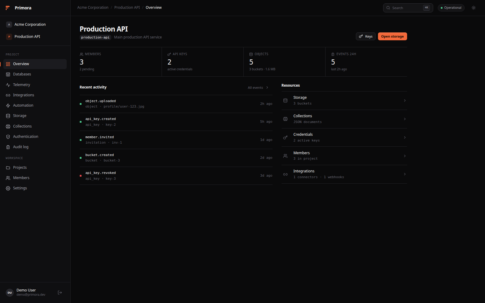
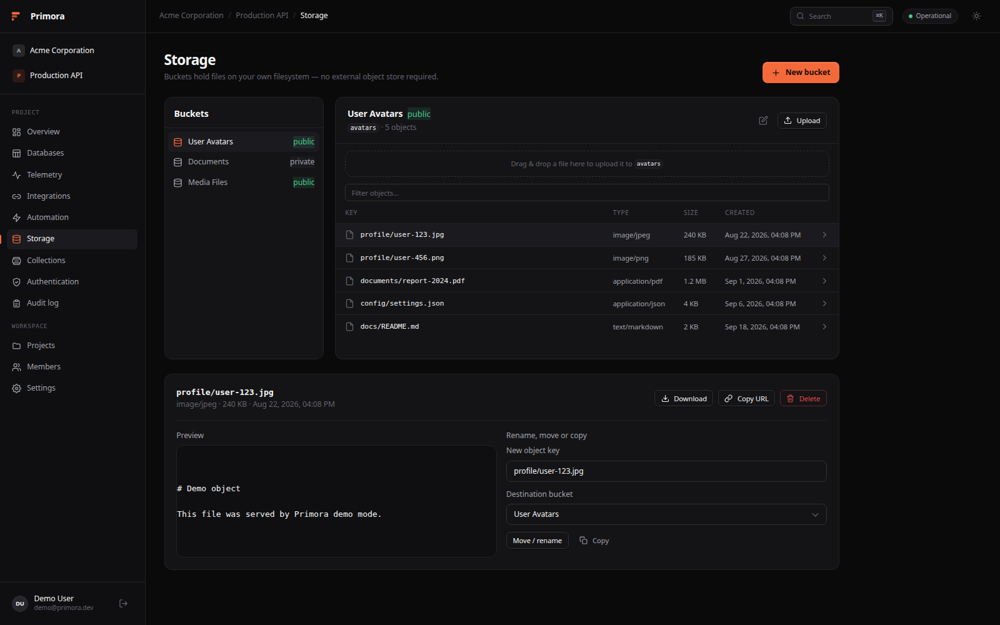
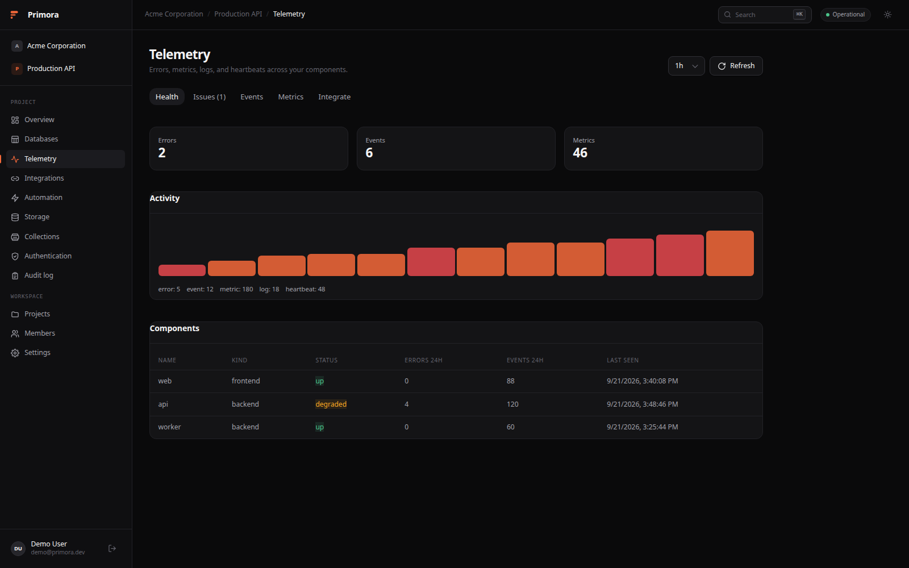
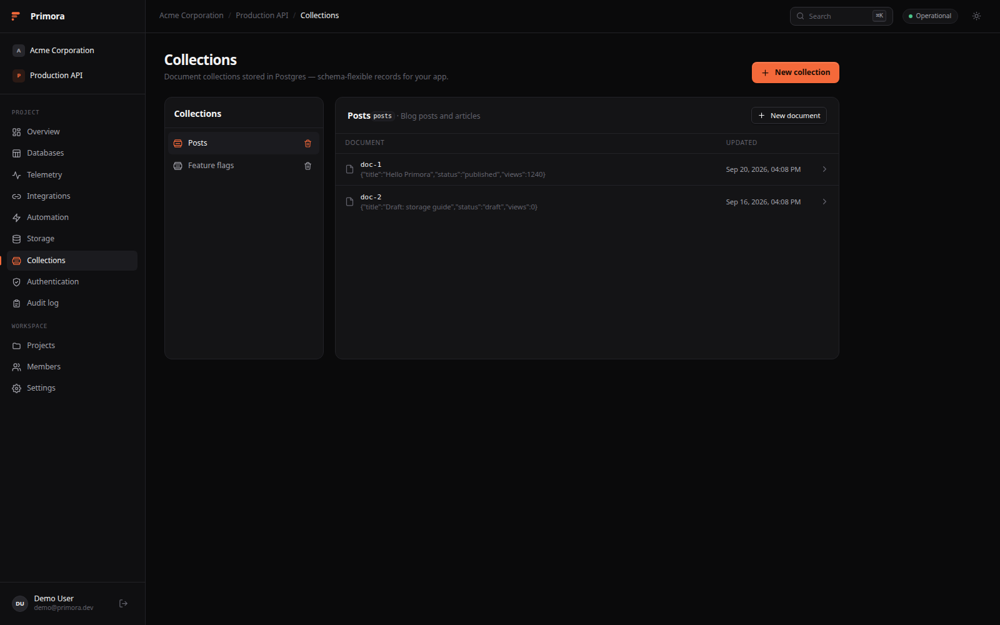
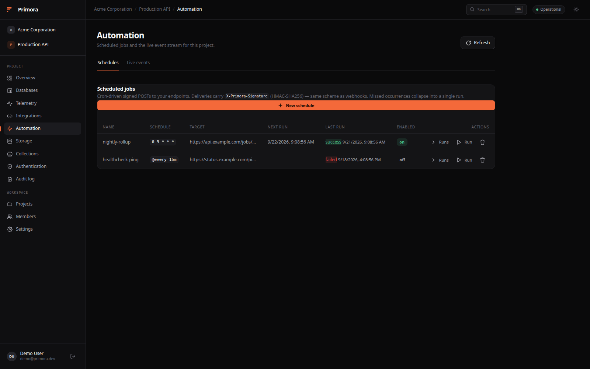
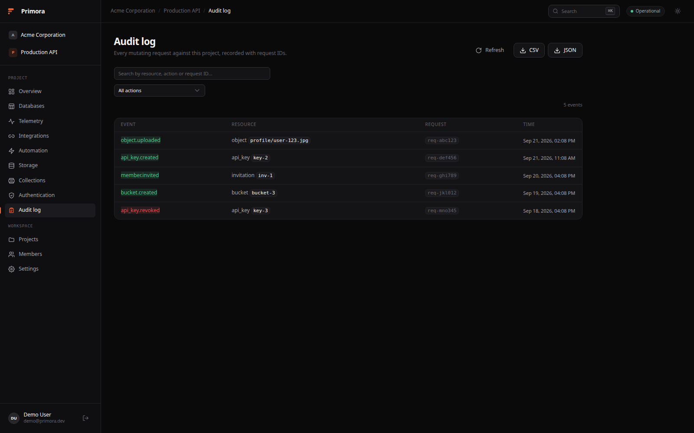

<p align="center">
  
</p>

<h1 align="center">Primora</h1>

<p align="center">
  Self-hosted backend platform for building products.<br>
  Auth, Postgres-backed APIs, object storage, and audit logs on your own hardware.
</p>

<p align="center">
  <a href="#quick-start">Quick Start</a> ·
  <a href="QUICK_START.md">Documentation</a> ·
  <a href="https://github.com/Dvorinka/Primora/releases">Releases</a> ·
  <a href="CONTRIBUTING.md">Contributing</a>
</p>

<p align="center">
  <a href="https://github.com/Dvorinka/Primora/actions/workflows/ci.yml"></a>
  <a href="https://github.com/Dvorinka/Primora/releases"></a>
  <a href="LICENSE"></a>
</p>

## What is Primora?

Primora is a self-hosted backend platform: organizations, projects, auth,
S3-style object storage, JSON document collections, scoped API keys, and a
full audit log behind one dashboard. Inspired by the UX of Appwrite and
Supabase, with no hosted tier - your data stays on your hardware.

## Screenshots

| Overview | Storage |
|:-:|:-:|
|  |  |
| **Telemetry** | **Collections** |
|  |  |
| **Automation** | **Audit log** |
|  |  |

## Features

- **Organizations & projects** - top-level workspaces containing projects, members, and scoped roles (`owner`/`admin`/`member` org roles, `admin`/`developer`/`viewer` project roles).
- **Auth** - email/password plus optional GitHub, Google, Discord, and Microsoft OAuth via Better Auth. JWTs minted by the auth service are verified by the Go API against JWKS.
- **Storage** - S3-style buckets and objects backed by your local filesystem, with public/private visibility and downloadable URLs.
- **Collections** - schema-flexible JSON documents stored in Postgres JSONB.
- **API keys** - `prm_<prefix>_<secret>` credentials; secrets are shown once.
- **Audit log** - every mutating request recorded with actor, resource, request ID, and timestamp; CSV/JSON export from the dashboard.
- **Generated client** - the TypeScript client is generated from `apps/backend/openapi/openapi.yaml`, so the API contract is the source of truth.
- **Demo mode** - a fully client-side workspace (`?demo=true` or `VITE_DEMO_MODE=true`) for trying the UI without a backend.

## Architecture

```
Browser ──▶ Nginx ──▶ Frontend (SolidJS + Vite)
                 ├──▶ Auth service (Better Auth + Hono)
                 └──▶ API (Go + Gin) ──▶ PostgreSQL
                                     ──▶ DragonflyDB (Redis-compatible cache)
                                     ──▶ Local filesystem object storage
```

| Service | Port | Purpose |
|---|---|---|
| nginx | 80 (`NGINX_PORT`) | Reverse proxy - only public entrypoint |
| backend | 8080 (internal) | Go + Gin API |
| auth | 3001 (internal) | Better Auth service |
| postgres | 5432 (`POSTGRES_PORT`) | Primary datastore |
| dragonfly | 6379 (`DRAGONFLY_PORT`) | Redis-compatible cache |
| mailpit (dev) | 8025 (`MAILPIT_HTTP_PORT`) | Email capture with `docker-compose.dev.yml` |

## Quick Start

Prerequisites: Docker with the Compose plugin.

### One-liner (no clone)

```bash
curl -fsSL https://raw.githubusercontent.com/Dvorinka/Primora/master/install.sh | bash
```

Installs into `./primora`, generates secrets, and starts the stack on port 80.
Non-interactive - configure with env vars:

```bash
DOMAIN=example.com NGINX_PORT=8080 PRIMORA_DIR=/opt/primora bash install.sh
```

The installer pulls prebuilt images from GHCR when they are published;
otherwise it downloads the source tarball and builds locally.

### From a clone

```bash
git clone https://github.com/Dvorinka/Primora.git && cd Primora
./scripts/setup.sh          # creates .env, generates secrets, starts the stack
```

or manually:

```bash
cp .env.example .env        # fill JWT_SECRET and BETTER_AUTH_SECRET
docker compose up -d        # builds the three app images from source
```

To run published images instead of building:

```bash
docker pull ghcr.io/dvorinka/primora-{backend,auth,frontend}:latest
docker compose up -d --no-build
```

Then open `http://localhost` (or append `?demo=true` to explore a seeded
workspace without signing up). For local email capture, add the dev overlay
(`-f docker-compose.dev.yml`) and Mailpit is at `http://localhost/mailpit/`.

### Useful commands

```bash
docker compose ps                  # service status + health
docker compose logs -f backend     # follow one service
docker compose pull && docker compose up -d   # update to latest release
docker compose down                # stop (data persists in volumes)
docker compose down -v             # stop and delete all data
```

### Verify the install

| Check | Endpoint |
|---|---|
| Frontend | `http://localhost/` |
| Backend liveness | `http://localhost/api/v1/health/liveness` |
| Backend readiness | `http://localhost/api/v1/health/readiness` |
| Auth health | `http://localhost/auth-health` |
| OpenAPI spec | `http://localhost/api/v1/openapi.yaml` |

## Configuration

All configuration lives in `.env` (see `.env.example` for the full list):

| Variable | Default | Purpose |
|---|---|---|
| `NGINX_PORT` | `80` | Public HTTP port |
| `POSTGRES_PORT` | `5432` | Host binding for Postgres |
| `DRAGONFLY_PORT` | `6379` | Host binding for Dragonfly |
| `JWT_SECRET` | - | Signs API tokens (required) |
| `BETTER_AUTH_SECRET` | - | Signs auth sessions (required) |
| `COOKIE_DOMAIN` | `localhost` | Cookie scope for auth sessions |
| `PRIMORA_ENCRYPTION_KEY` | - | AES-256 key encrypting secrets at rest |

Only host bindings change when you move ports - the internal network stays
the same. OAuth providers, SMTP, and storage limits are documented in
`.env.example` and [QUICK_START.md](QUICK_START.md).

## Local development

```bash
docker compose up -d postgres dragonfly mailpit   # infrastructure only
cd apps/backend && go run ./cmd/server            # API on :8080
npm run dev:auth                                  # auth on :3001
npm run dev:frontend                              # dashboard (Vite)
```

Point the frontend at the stack by adding to `apps/frontend/.env.local`:

```env
VITE_API_BASE_URL=http://localhost/api/v1
VITE_AUTH_BASE_URL=http://localhost/auth
```

Or skip all of it: `http://localhost:<vite-port>/?demo=true` runs entirely in the browser.

## CLI

```bash
npm run build --workspace @primora/cli   # → apps/cli/dist/cli.js
node apps/cli/dist/cli.js login          # or: npx primora login once published
```

Supports session sign-in (`primora login`) and API-key mode (`primora login --api-key prm_…` or `PRIMORA_API_KEY`). Context lives in `~/.config/primora/config.json`; `primora use` picks org + project interactively. Commands: `orgs`, `projects`, `buckets`, `objects` (list/upload/download/rm), `keys`, `audit list --follow`. Every command accepts `--json`.

## Desktop & phone

- **Desktop** - `apps/desktop` is a Tauri 2 shell (Linux/Windows/macOS). First
  run asks for your deployment URL, then renders the same dashboard in a
  webview with a system-tray presence. Nothing is bundled; your server does the
  work. See [apps/desktop/README.md](apps/desktop/README.md).
- **Phone / PWA** - the dashboard ships a web manifest and service worker.
  Open your deployment in a mobile browser and "Add to Home Screen"; the shell
  is precached, API traffic always goes to the network. Chromium desktop
  browsers get an in-app install banner.

## Quality gate

```bash
npm run check        # backend tests + frontend typecheck + build + generated-code drift check
npm test             # workspace tests
npm run generate:sqlc    # regenerate sqlc after changing queries/schema
npm run generate:client  # regenerate the TS client after changing openapi.yaml
```

## Repository layout

```
apps/
  backend/     Go + Gin API, sqlc, migrations, object storage
  auth/        Better Auth on Hono (sessions, JWT, OAuth, mail)
  frontend/    SolidJS + Tailwind dashboard
  cli/         `primora` CLI - login, context, projects, buckets, objects, keys, audit
  mcp/         `@primora/mcp` - MCP stdio server exposing `primora_*` tools
  desktop/     Tauri 2 shell - connects to a deployment URL, tray presence
packages/
  api-client/  OpenAPI-generated TypeScript client (do not hand-edit)
  shared-types/
infra/nginx/   Reverse proxy config
scripts/       setup.sh, verify-production-ready.sh
```

## Documentation

- [QUICK_START.md](QUICK_START.md) - setup, configuration, troubleshooting
- [project_backend.md](project_backend.md) / [project_frontend.md](project_frontend.md) - original design specs
- `apps/backend/openapi/openapi.yaml` - API contract

## Contributing

See [CONTRIBUTING.md](CONTRIBUTING.md) for the development workflow.

## Security

See [SECURITY.md](SECURITY.md) for reporting vulnerabilities.

## License

[MIT](LICENSE)
